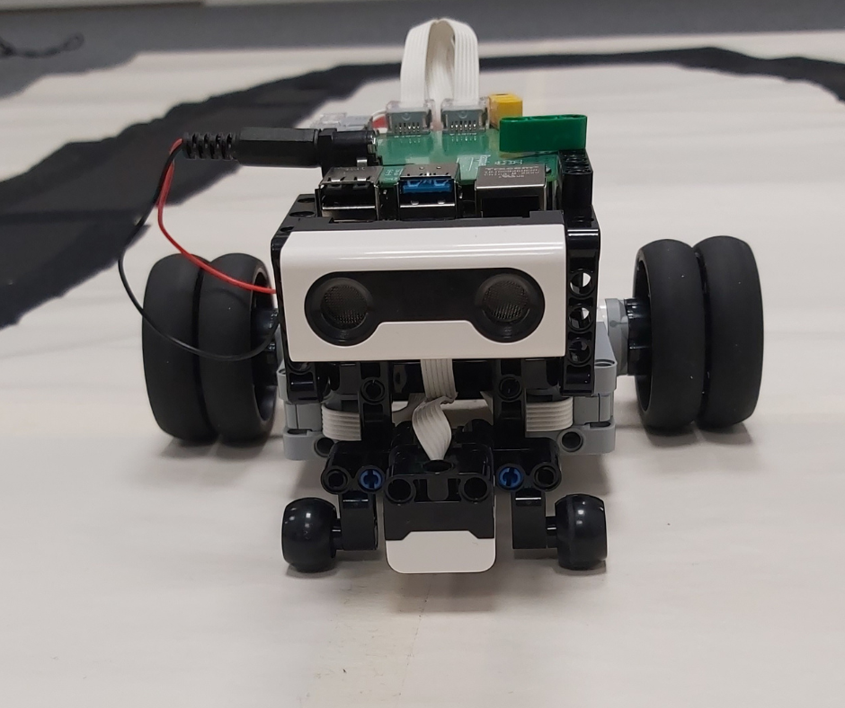

# AIM-HIGH
## Autonomous Robot Project

Welcome to our Git repository dedicated to our robotics project. This project progresses through distinct phases, each critical in developing an autonomous robot with advanced capabilities.

In Phase 1, we successfully achieved proficiency in line following and obstacle avoidance, marking a significant milestone.

Building on this success, Phase 2 saw the integration of QR-code reading functionality along with object detection, enabling a comprehensive set of capabilities. We're pleased to report substantial progress in these areas, showcasing our commitment to enhancing the robot's versatility.

Feel free to explore our repository to learn more about the project's evolution and the exciting developments in each phase.

The repository contains the source code, documentation, schematics, and additional materials necessary to build, operate, and extend our robot. By collaborating on this platform, we aim to refine and expand our project, exploring new features and use cases. We welcome contributions, feedback, and collaboration from the open-source and robotics communities to drive innovation and advance the field of autonomous robotics.


## Table of Contents
- [Hardware and Software](#hardware-and-software)
- [Getting Started](#getting-started)
  - [Installation](#installation)
- [Project Phases and Usage](#project-phases-and-usage)
- [Issues and Solutions](#issues-and-solutions)
- [Contributors](#contributors)
- [License](#license)
- [Acknowledgments](#acknowledgments)

## Hardware and Software

-**Lego Mindstorms Set:** We are using the Lego Mindstorms set, model number 51515, as the foundation for our robot's construction. This comprehensive set provides essential building blocks and components critical to the success of our project.

-**Programming Language:** Our project is primarily coded in Python, chosen for its versatility and ease of use in the context of robotics development.

-**Microcomputer:** The brain of our robot is powered by the Raspberry Pi 4, a powerful microcomputer that serves as the central processing unit for executing our code. Complementing the Raspberry Pi is the Lego BuildHAT, a dedicated hardware attachment facilitating seamless integration of sensors and enhancing the overall capabilities of our robot.

-**Camera Module:** For advanced vision capabilities, we are utilizing the Raspberry Pi Camera Module. This allows our robot to capture visual data, a crucial aspect of the upcoming Phase 2 and phase 3.


## Getting Started


### Installation

1. Clone this repository:
    ```bash
    git clone https://github.com/Inoshas/Raspberry-Pi-Build-Hat-demos-with-Mindstorm-51515

2. Navigate to the project directory: 
    ```bash
      cd your-repository 
    ```
    
3. Install project dependencies:
    ```bash
      sudo apt update
      sudo apt install python3-buildhat
    ```
    
Note: Replace python3 with python if your system uses Python 2.x.

For more information and simple examples please follow below link.
- [Basic instalation and configurations with mindstorm 51515](https://github.com/Inoshas/Raspberry-Pi-Build-Hat-demos-with-Mindstorm-51515)


## Project Phases and Usage:
### Phase 1: Line Following and Obstacle Avoidance



In this phase, we have harnessed the potential of Lego Mindstorms, Python, and Raspberry Pi to create a robot that adeptly follows lines with precision, detects obstacles, and intelligently maneuvers around them. The completion of this phase establishes a solid foundation for our project.

 **Usage:**
The phase1.py script encapsulates Python code for path following and obstacle detection in our robotics project. For path following, we implement a Proportional-Integral-Derivative (PID) control model to regulate the robot's speed. In the event of obstacle detection, the robot dynamically assesses alternative routes in both right and left directions if available. If no clear paths are found, the robot patiently waits until its designated path becomes unobstructed.

[Here you can watch our demo video.](https://www.youtube.com/shorts/L-W8-ZdgTtk)

### Phase 2: QR-code Reading and Database Update
In Phase 2, we leverage the Raspberry Pi camera module and the OpenCV library to implement QR code detection in our robotics project. This phase marks our venture into integrating machine vision, where we incorporate existing machine learning models.

For testing purposes, we have integrated two distinct projects into our system. The first, utilizing the [YOLOv5](https://github.com/ultralytics/yolov5) model, involves capturing and processing images upon QR code detection. The second project, denoted as real-time object detection(RTOD) which focus to detect objects in realtime using camera module.

Currently, the YOLOv5 model is successfully integrated into our project, enhancing its capabilities. Stay tuned for the upcoming integration of the RTOD model.

**Usage:**
The mydatabase.db file serves as the dedicated database for our project, capturing and organizing entries generated by the db_qr_generator.py script. This structured repository houses our project's inventory data, and the script also generates QR codes, storing them in the QR_code folder.

Within the phase2.py script, we seamlessly integrate barcode and object detection using the YOLOv5 model. Looking ahead, we plan to further enhance this functionality by incorporating real-time object detection with the upcoming RTOD module. In this phase, once the robot detects a QR code, it captures an image and identifies the corresponding object. This innovative approach allows us to compare database entries with the current location, providing valuable insights, especially in retail settings. For instance, the robot can determine whether goods are placed in the correct rack within a shop.

[Here you can watch our demo video.](https://www.youtube.com/watch?v=ouIGsvfRSzo)

## Issues and Solutions
#### Problem: Motors Not Functioning Well at Lower Speeds
**Description:**
While coding, we observed that the motors, especially at lower speeds, exhibited performance issues. This issue is not specific to our custom robot but also occurs with the in-built Mindstorms hub.

**Solution:**
To address this issue and improve motor performance at lower speeds, we recommend using the following lines of code. This adjustment can be achieved using the buildhat library.

  ```shell
  pair._leftmotor.plimit(1.0)
  pair._leftmotor.bias(0.5)
  pair._rightmotor.plimit(1.0)
  pair._rightmotor.bias(0.5)
  ```

These lines set a power limit (plimit) and bias for both the left and right motors. Adjusting these parameters can help mitigate the performance challenges observed at lower speeds. Feel free to experiment with the values to find the optimal settings for your specific setup.

By incorporating these lines into your code, you can enhance the functionality of your motors and achieve smoother operation, especially at lower speeds. We recommend documenting this solution to assist other users who may encounter similar motor performance issues.


## Contributors

- [Antti Buller](https://github.com/anatt1b)  
- [Inosha Sugathapala](https://github.com/Inoshas)
- [Mari Kivioja](https://github.com/Veaiga)


## License
MIT-Licence 


## Acknowledgments

This project has received funding from OpriFrame and serves as the final project associated with the work training provided by OpriFrame.

- [Opiframe](https://opiframe.com)  
- [Janne Kemppi](https://jannekemppi.wordpress.com) 
- [Jussi Riihijärvi](https://www.linkedin.com/in/jussiriihij%C3%A4rvi)


