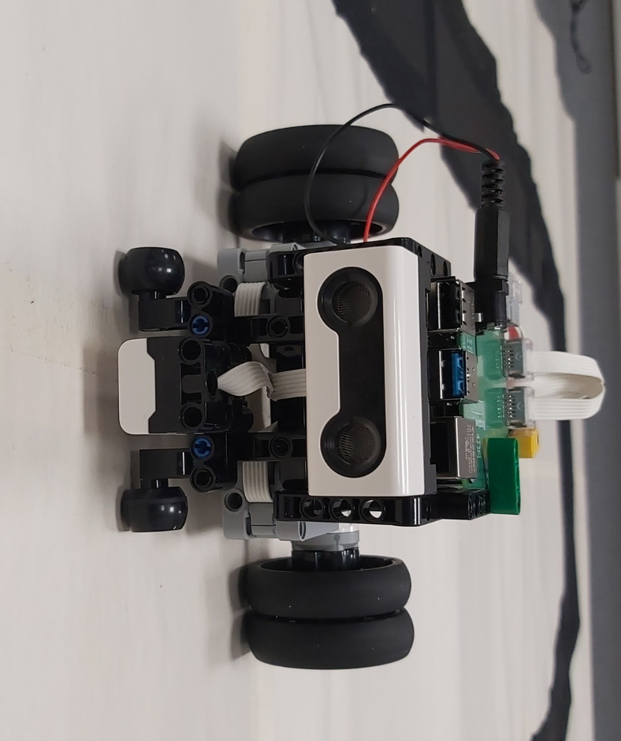

# AIM-HIGH
## Autonomous Robot Project

Welcome to the Git repository dedicated to our exciting robotics project. This initiative unfolds in several phases, each contributing to the development of an autonomous robot with advanced capabilities. As of now, we have successfully completed Phase 1, which focuses on line following and obstacle avoidance.

The repository contains the source code, documentation, schematics, and additional materials necessary to build, operate, and extend our robot. By collaborating on this platform, we aim to refine and expand our project, exploring new features and use cases. We welcome contributions, feedback, and collaboration from the open-source and robotics communities to drive innovation and advance the field of autonomous robotics.


## Table of Contents

- [Project Phases](#project-phases)
- [Hardware and Software](#hardware-and-software)
- [Issues and Solutions](#issues-and-solutions)
- [Getting Started](#getting-started)
  - [Prerequisites](#prerequisites)
  - [Installation](#installation)
- [Usage](#usage)
- [Contribution Guidelines](#contribution-guidelines)
- [License](#license)
- [Acknowledgments](#acknowledgments)


## Project Phases:
**Phase 1:** Line Following and Obstacle Avoidance
In this phase, we have harnessed the potential of Lego Mindstorms, Python, and Raspberry Pi to create a robot that adeptly follows lines with precision, detects obstacles, and intelligently maneuvers around them. The completion of this phase establishes a solid foundation for our project.



**Phase 2:** Machine Learning Application for Sign Recognition
Our next undertaking involves the integration of machine learning techniques to enable the robot to interpret signs, with a primary emphasis on left and right directions. This phase will utilize the Raspberry Pi camera for image processing. While still a work in progress, Phase 2 aims to enhance the robot's cognitive abilities and expand its functionality.

**Phase 3:** Barcode Reading and Database Update
The upcoming Phase 3 will introduce barcode reading capabilities to our robot. Additionally, we plan to integrate functionality to update a database based on the information gathered. This phase represents a pivotal step toward creating a versatile and intelligent robotic system with applications across diverse industries.


## Hardware and Software

-**Lego Mindstorms Set:** We are using the Lego Mindstorms set, model number 51515, as the foundation for our robot's construction. This comprehensive set provides essential building blocks and components critical to the success of our project.

-**Programming Language:** Our project is primarily coded in Python, chosen for its versatility and ease of use in the context of robotics development.

-**Microcomputer:** The brain of our robot is powered by the Raspberry Pi 4, a powerful microcomputer that serves as the central processing unit for executing our code. Complementing the Raspberry Pi is the Lego BuildHAT, a dedicated hardware attachment facilitating seamless integration of sensors and enhancing the overall capabilities of our robot.

-**Camera Module:** For advanced vision capabilities, we are utilizing the Raspberry Pi Camera Module. This allows our robot to capture visual data, a crucial aspect of the upcoming Phase 2 where we will be implementing machine learning for sign recognition.


(Image goes here)

## Issues and Solutions
#### Problem: Motors Not Functioning Well at Lower Speeds
**Description:**
While coding, we observed that the motors, especially at lower speeds, exhibited performance issues. This issue is not specific to our custom robot but also occurs with the in-built Mindstorms hub.

**Solution:**
To address this issue and improve motor performance at lower speeds, we recommend using the following lines of code. This adjustment can be achieved using the buildhat library.

  ```shell
  pair._leftmotor.plimit(1.0)
  pair._leftmotor.bias(0.5)
  pair._rightmotor.plimit(1.0)
  pair._rightmotor.bias(0.5)
  ```

These lines set a power limit (plimit) and bias for both the left and right motors. Adjusting these parameters can help mitigate the performance challenges observed at lower speeds. Feel free to experiment with the values to find the optimal settings for your specific setup.

By incorporating these lines into your code, you can enhance the functionality of your motors and achieve smoother operation, especially at lower speeds. We recommend documenting this solution to assist other users who may encounter similar motor performance issues.


## Getting Started

### Prerequisites

Before getting started with the project, ensure you have the above hardware components and software installed.

### Installation

Follow these steps to set up your project:

1. [Insert installation steps here- software+hardware.]

## Usage

[Explain how to use the project once it's set up]

## Contributors

- [Antti Buller](https://github.com/anatt1b)
  
- [Inosha Sugathapala](https://github.com/Inoshas)
 
- [Mari Kivioja](https://github.com/Veaiga)


## License


## Acknowledgments


